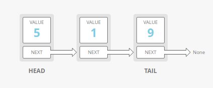

# Data Structure Notes
# Table of Contents

[//]: #[](#name-of-header)

1. [Arrays (Static/Dynamic)](#arrays-staticdynamic)
2. [Linked Lists](#linked-lists)
3. [Stack](#stack)
4. [Queue](#queue)
5. [Trees](#trees)
6. [Graphs](#graphs)

# Arrays (Static/Dynamic)
## Static Arrays
Arrays store homogeneous data sequentially in memory.

Each element has an **index**, starting at 0.

### Strengths
* **Fast look-ups**: O(1) Time regardless of length
* **Fast Appending**: O(1) time to add element in the **end** of the array
* **Cache-Friendly**: Since data is stored sequentially

### Weaknesses
<ul>
    <li> <strong>Fixed Size</strong>: You need to specify the length of the array </li>
    <li>
    <strong>Costly Insertion/Deletion</strong>: In order to insert/delete elements, the rest of the elements need to "scoot over" to fill the empty cell. Worst case being O(n) time when preppending or deleting 1st element.

Array Insertion             |  Array Deletion
:-------------------------:|:-------------------------:
  |  
</li>
</ul>

## Dynamic Arrays
Arrays with *automatic resizing* 

### Strengths
* **Fast Look-ups**: O(1) Time
* **Variable Size**: Array will expand as you add elements to it
* **Cache-Friendly**: Since data is stored sequentially

### Weaknesses
* **Costly Insertion/Deletion**: Just like static Arrays, data needs to move when inserting/deleting elements that are not in the end of the array.

([Back to top](#table-of-contents))

# Linked Lists
Linked List is a linear data structure in which elements are not stored at contiguous memory locations. Rather, the items in a linked list are *linked* through pointers.

Items in a linked list are called **nodes**, the first node being the **head** and the last node being the **tail**.

### Strengths
* **Dynamic Size**: You can increase/decrease the size of the array during runtime.
* **Faster insertion/deletion operations**: To insert/delete, you don't need to shift elements. Only change the pointer from one node to another. 
Adding/removing elements in the head or tail takes O(1) time.
* **Implementation**: Linear data structures like stacks and queues are easily implemented with linked lists. They also only need fast operations in the ends, so linked lists are ideal.
* **No memory wastage**: The size of a linked list is dynamic so there is no need to pre-allocate memory.

### Weaknesses
* **Costly look-ups**: *Random access* is not possible due to its dynamic memory allocation. To access the ith element, you need to traverse the array from the head, taking O(i) time.
* **Memory usage**: More memory is required in a linked list compared to an array. A pointer not only store the address of another node, but it also requires extra memory for itself.

Analogy: linked lists are like a chain of paper clips. 

## Singly Linked List
Singly Linked Lists only have one pointer linking one node to another. Therefore, items can only be navigated forward.

### Implementation
Python:
```
class Node:
    def __init__(self, val=None) -> None:
        self.val = val
        self.next = None

class LinkedList:
    def __init__(self) -> None:
            self.head = self.tail = None
    
    def append(self, val) -> Node:
        newNode = Node(val)
        if not self.head:
            self.head = self.tail = newNode
        else:
            self.tail.next = newNode
            self.tail = newNode 
    
    # Prepend node to list and return new head
    def prepend(self, val) -> Node:
        if self.head is None:
            self.head = self.tail = Node(val)
        else:
            temp = Node(val)
            temp.next = self.head
            self.head = temp
        return self.head

    def insert(self, val, index) -> bool:
        if index > len(self):
            return False

        newNode = Node(val)
        i = 0
        prev = None
        cur = self.head
        while i < index:
            i+=1
            prev = cur
            cur = cur.next
        
        prev.next = newNode
        prev.next.next = cur
        return True
        
    def delete(self, val) -> Node:
        prev = None
        cur = self.head
        found = False
        while cur and not found:
            if cur.val == val:
                found = True
            else:
                prev = cur
                cur = cur.next
        
        if not found:
            return None
        # If previous is none, node to be deleted is head
        if prev is None:
            self.head = cur.next
        else:
            prev.next = cur.next

        return cur

    # If search is sucessful, return index position. Otherwise, None
    def search(self, val) -> int:
        index = 0
        cur = self.head
        while cur:
            if cur.val == val:
                return index
            index += 1
            cur = cur.next
        
        return -1

    def __str__(self) -> str:
        toString = ""
        cur = self.head
        while cur:
            toString += str(cur.val) + " "
            cur = cur.next
        return toString

    def __len__(self) -> int:
        cur = self.head
        length = 0
        while cur:
            cur = cur.next
            length += 1
        return length
```
Go:
```
```


## Doubly Linked List

# Stack

# Queue

# Trees

# Graphs

